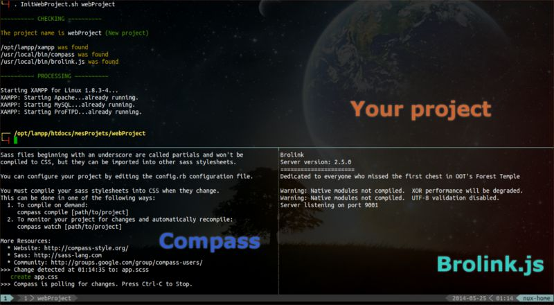

ISWP for Initialize Simple Web Project
======================================

Description
-------------

Personal and simple bash script who initializes what needed for my simple web projects (Static sites in general) in the current tmux window in different tmux panes (Tested in GNU/Linux only).

What the script do:

- Start [LAMMP](http://en.wikipedia.org/wiki/LAMP_%28software_bundle%29).
- Create and watch or just watch (If the project already exists) our project with [Compass](http://compass-style.org/).
- Start [brolink.js](https://github.com/jaxbot/brolink.vim) (A vim plugin).
- Move the current shell to the project directory.

Installation
------------

After getting the script just create a symbolic link to a folder of the `$PATH`.

As an example:

	# ln -s ISWP.sh/InitWebProject.sh /usr/local/bin
	# chmod +x /usr/local/bin/InitWebProject.sh

Configuration
-------------

To suit your needs you should in the beginning set the correct variables in the script.

Here are mines to understand:

	# 1) Project folder.
	root="/opt/lampp/htdocs/mesProjets/$project_name"

	# 2) Localization of binaries.
	lammp="/opt/lampp/xampp"
	compass="/usr/local/bin/compass"
	brolink="/usr/local/bin/brolink.js"

You can change also the parameters of the initial compass execution in the function `executeCompass`.

By default:

- The css folder is `css` instead of `stylesheets`.
- The output style is `nested`.
- The comments are disabled.
- The compass css and scss files are not generated, a simple empty `app.css` is generated.

For [brolink.js](https://github.com/jaxbot/brolink.vim) please refer to his github repo to know how to configure it.

Usage
-----

Just source the script in an empty tmux window with the *project name* as an argument.

	. InitWebProject.sh projectName

*P.S:* Don't use spaces in the project name.

That's all :)

Notes
-----

This personal script is very simple which allows to adapt it to your needs easily.
